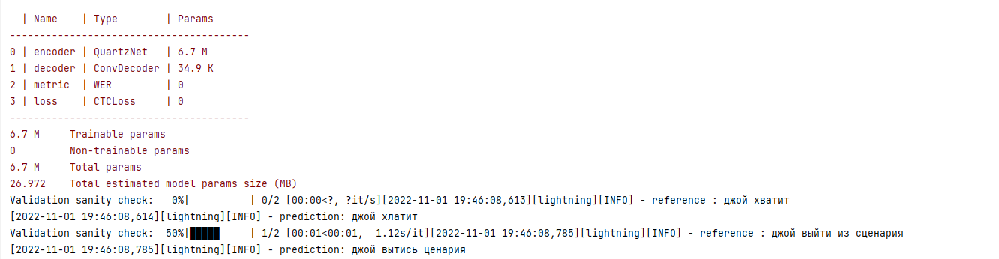

# Отчет

## 1. Реализация Quartznet
Реализуем модель из статьи [QUARTZNET: DEEP AUTOMATIC SPEECH RECOGNITION WITH 1D TIME-CHANNEL SEPARABLE CONVOLUTIONS](https://arxiv.org/pdf/1910.10261.pdf).

## 2. Проверка модели
Загрузим веса модели из предобученного чекпойнта и убедимся, что модель выдает адекватные предсказания.

Обучим модель на 80 примерах большое количество эпох, чтобы проверить корректность реализации. 
Используем параметр Trainer "overfit_batches" (см. конфигурацию в [quartznet_5x5_ru_overfit.yaml](./conf/quartznet_5x5_ru_overfit.yaml)).

Как мы видим, после 2500 шагов значение CTC loss и WER и упали почти до 0.